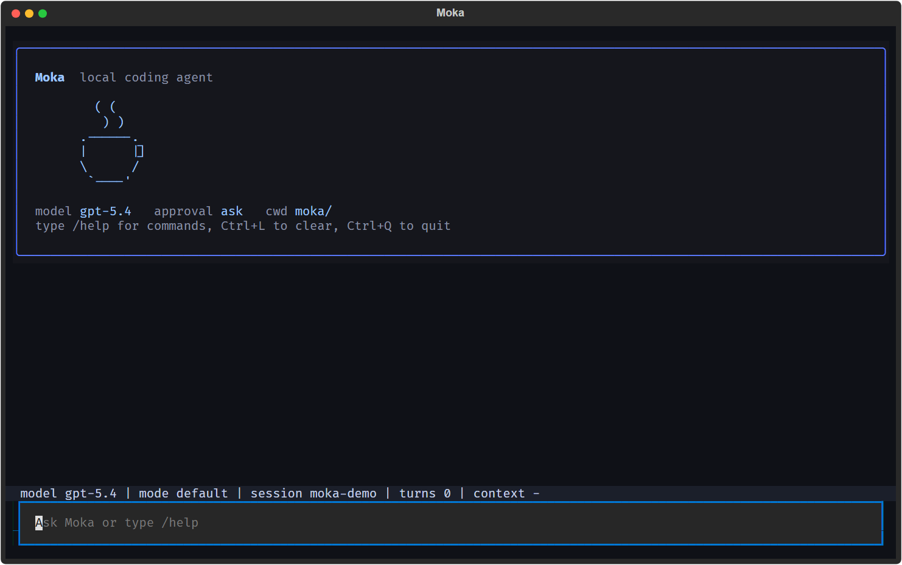
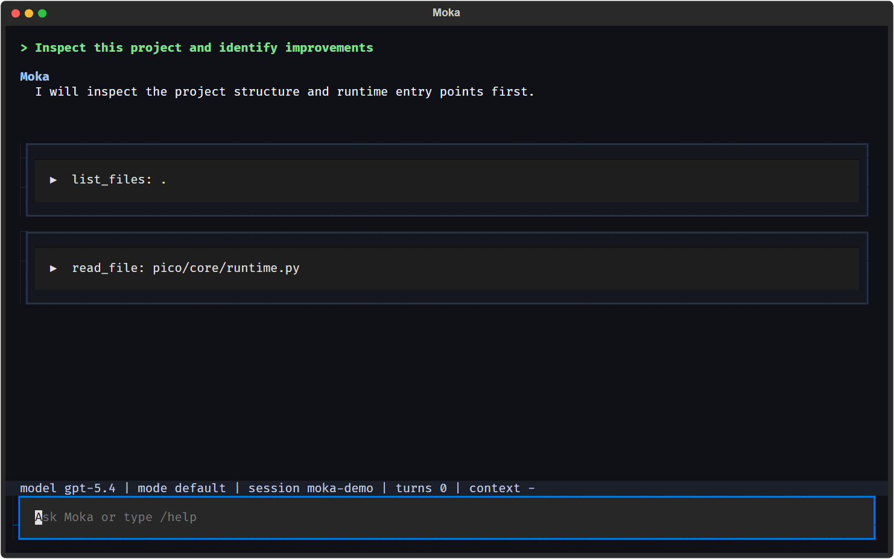
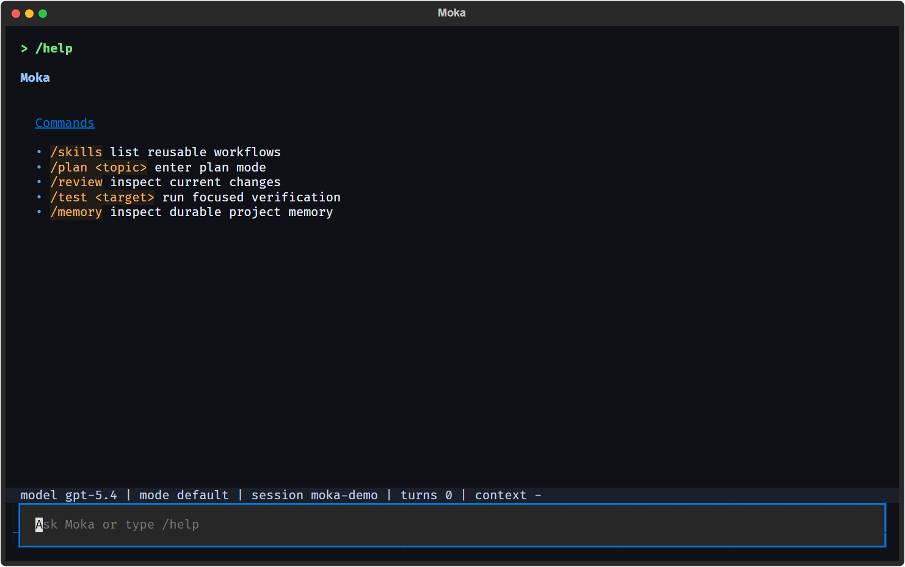
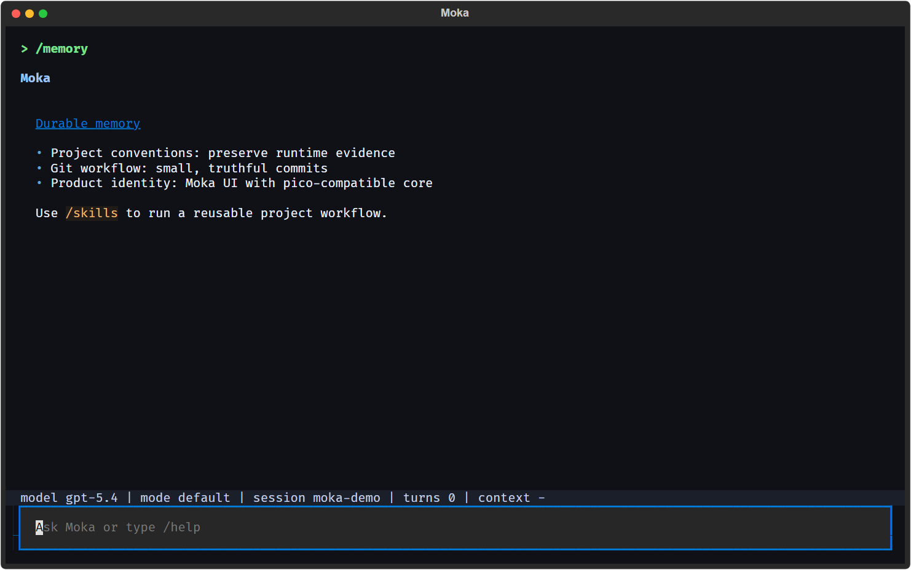
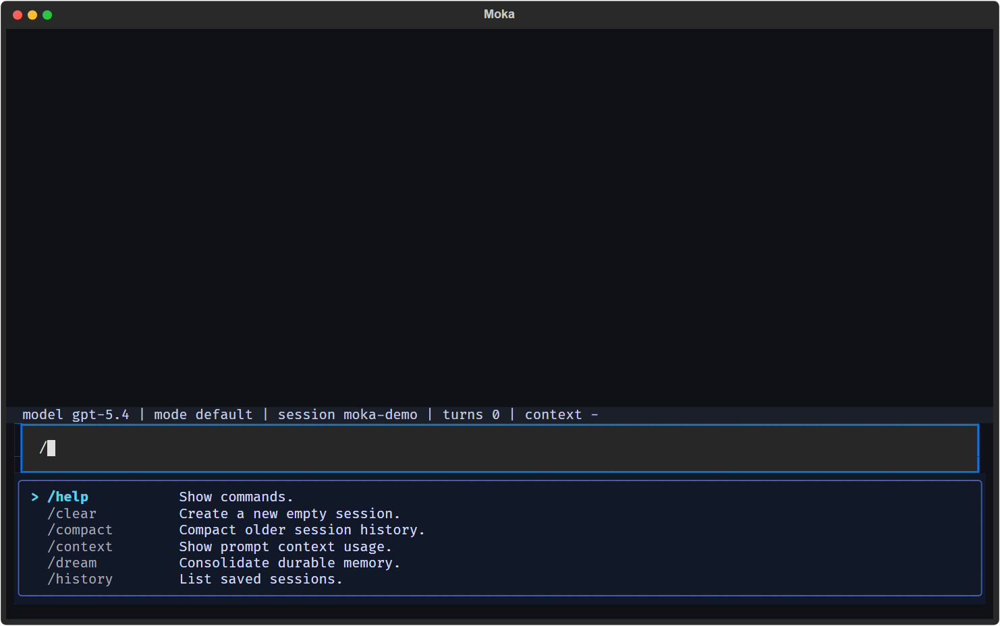

<div align="center">

# Moka

**轻量、本地、有记忆的终端 coding agent**

[](https://www.python.org/)
[](LICENSE)
[](#moka-是什么)

Moka 跑在本地仓库里，接上一个模型 provider，就能读代码、跑命令、改文件、
保留运行证据，并把有价值的上下文沉淀成本地记忆。

Moka 是基于 pico 二次开发的终端 coding agent，保留稳定内核并持续改进交互、兼容入口和工程体验。

`moka` 启动 TUI，`moka --repl` 进入终端会话，`moka "任务描述"` 直接执行单次任务。

</div>

<p align="center">
  
</p>

---

## Moka 是什么

Moka 是一个本地终端里的 coding agent，运行在你的仓库上下文里。一次 agent 运行会被拆成几个可观察的部分：

- **provider profile**：决定调用哪个模型、哪个 endpoint、用什么协议。
- **context**：把系统提示、仓库信息、skills、记忆和最近对话装进 prompt。
- **tools**：文件读取、搜索、shell、写文件、patch、子 agent 都走统一工具协议。
- **approval / sandbox**：写操作和 shell 命令可以被审批或沙箱限制。
- **session / run evidence**：对话、事件流、trace、report 都写到本地 `.pico/`。
- **memory / dream**：把 daily log 整理成长期 topic，下次 session 可以继续用。

Moka 关注本地 coding agent 的工程边界：配置清楚、任务能续接、结果能复盘。

## 核心能力

| 本地优先 | 工程化运行 | 可持续协作 |
| --- | --- | --- |
| 在当前仓库上下文中工作，配置、会话和记忆都保存在本地。 | 用统一的 Runtime、工具协议、权限策略和运行证据串起一次任务。 | 通过 session、working memory、durable memory 和 Dream 延续长期工作。 |

| 多模型接入 | 终端体验 | 可靠性边界 |
| --- | --- | --- |
| 支持 OpenAI-compatible、Anthropic-compatible 与 DeepSeek provider profile。 | 同一运行时提供 TUI、REPL 和 one-shot 三种入口。 | 支持审批、可选 sandbox、任务 trace、评测与受控 worker。 |

## 界面

TUI 直接连接同一个 runtime。输入框、工具结果、状态栏、slash command 和补全都来自当前 session。

| 工具和子 agent | Skills、help 和命令补全 |
| --- | --- |
|  |  |

| Memory 和 durable topics | Slash command 工作区 |
| --- | --- |
|  |  |

## 安装

要求：Python 3.10+，以及至少一个可用的模型 provider key。

一键安装：

```bash
curl -fsSL https://raw.githubusercontent.com/Sylvia145/moka/main/install.sh | bash
```

源码安装：

```bash
git clone https://github.com/Sylvia145/moka.git
cd moka
pip install -e .
```

开发 checkout 里也可以直接跑：

```bash
uv run moka
```

## 配置 provider

Moka 启动前先解析一个 **provider profile**。一个 profile 主要由四项组成：

| 字段 | 作用 |
| --- | --- |
| `protocol` | 请求协议，目前支持 `openai` 和 `anthropic`。 |
| `api_key` | 发给 provider 的 key。 |
| `base_url` | provider endpoint。 |
| `model` | 本次请求使用的模型名。 |

配置合并优先级是：

```text
CLI 参数 > 环境变量 > 项目 .pico.toml > 全局 ~/.config/pico/config.toml > 代码默认值
```

### 方式一：项目 `.pico.toml`

这是最推荐的配置方式，适合每个仓库独立指定 provider：

```bash
cp .pico.toml.example .pico.toml
$EDITOR .pico.toml
```

`.pico.toml` 默认被 `.gitignore` 忽略，不要把真实 key 提交进 git。

最小可用示例：

```toml
provider = "deepseek"

[providers.deepseek]
protocol = "anthropic"
api_key = "sk-..."
base_url = "https://api.deepseek.com/anthropic"
model = "deepseek-v4-pro"

[providers.openai]
protocol = "openai"
api_key = "sk-..."
base_url = "https://www.right.codes/codex/v1"
model = "gpt-5.4"

[providers.anthropic]
protocol = "anthropic"
api_key = "sk-ant-..."
base_url = "https://www.right.codes/claude/v1"
model = "claude-sonnet-4-6"
```

注意：`provider = "deepseek"` 只是选择 profile 名字，真正决定请求格式的是
`protocol`。例如 DeepSeek 可以通过 Anthropic-compatible endpoint 使用，所以这里写
`protocol = "anthropic"`。

### 方式二：环境变量

不想把 key 写进 TOML 时，用环境变量：

```bash
export PICO_PROVIDER=deepseek
export DEEPSEEK_API_KEY=sk-...
export DEEPSEEK_BASE_URL=https://api.deepseek.com/anthropic
export DEEPSEEK_MODEL=deepseek-v4-pro

moka
```

常用 provider 变量：

| Provider | 变量 |
| --- | --- |
| DeepSeek | `DEEPSEEK_API_KEY`, `DEEPSEEK_BASE_URL`, `DEEPSEEK_MODEL` |
| OpenAI-compatible | `OPENAI_API_KEY`, `OPENAI_BASE_URL`, `OPENAI_MODEL` |
| Anthropic-compatible | `ANTHROPIC_API_KEY`, `ANTHROPIC_BASE_URL`, `ANTHROPIC_MODEL` |

如果你的网关给 OpenAI-compatible 和 Anthropic-compatible 共用同一个 key，
也可以设置 `PICO_RIGHT_CODES_API_KEY` 作为 fallback。

也可以用通用覆盖变量：

```bash
export PICO_API_KEY=sk-...
export PICO_BASE_URL=https://api.openai.com/v1
export PICO_MODEL=gpt-5.4
```

### 方式三：命令行临时覆盖

临时换 provider 或模型：

```bash
moka --provider openai --model gpt-5.4 --base-url https://api.openai.com/v1
moka --provider deepseek --approval ask --max-steps 80
moka --config /path/to/custom.toml --cwd /path/to/repo
```

完整配置说明见 [docs/configuration.md](docs/configuration.md)。

## 启动

常用入口：

```bash
moka                              # 默认 Textual TUI
moka --repl                       # 普通终端 REPL
moka "找出测试失败的根因"          # one-shot 任务
moka --resume latest              # 续接最近 session
moka --cwd /path/to/repo          # 指定工作目录
```

常用运行参数：

```bash
moka --approval ask               # shell / 写文件前询问
moka --approval auto              # 普通操作自动通过
moka --approval never             # 非交互模式
moka --sandbox best_effort        # 尽量隔离 shell 命令
moka --no-auto-dream              # 关闭后台 memory 整合
```

## 日常用法

进入 TUI 或 REPL 后可以直接输入自然语言，也可以用 slash command：

```text
> /help
> /skills
> 找出测试失败的根因
> /plan 重构 provider 配置加载逻辑
> /review
> /test tests/test_config.py
> /remember 这个项目用 DeepSeek 的 Anthropic-compatible endpoint
> /dream
```

常用命令：

| 命令 | 作用 |
| --- | --- |
| `/help` | 查看内置命令。 |
| `/skills` | 列出可用 skills。 |
| `/session` | 查看当前 session、events、run 路径。 |
| `/history` | 列出历史 session。 |
| `/resume latest` | 续接最近 session。 |
| `/context` | 查看 prompt context 使用情况。 |
| `/usage` | 查看 provider、model、token 元数据。 |
| `/memory` | 查看 durable memory 索引。 |
| `/working-memory` | 查看当前 session 工作记忆。 |
| `/remember <text>` | 保存一条 durable note 到 daily log。 |
| `/dream` | 把 daily log 整合成 durable memory topics。 |
| `/plan <topic>` | 进入 plan mode。 |
| `/plan-exit` | 退出 plan mode。 |
| `/agents` | 查看子 agent 状态。 |
| `/model <name>` | 当前 session 临时切模型。 |
| `/compact` | 压缩较早的对话历史。 |
| `/clear` | 开一个新的空 session。 |
| `/exit` | 退出 Moka。 |

## Moka 能做什么

| 能力 | 说明 |
| --- | --- |
| TUI / REPL / one-shot | 同一个 runtime，通过不同入口使用。 |
| 工具执行 | 文件列表、读文件、搜索、shell、写文件、patch、ask_user、子 agent、todo。 |
| Plan mode | 先读代码和拆计划，再进入可写执行阶段。 |
| 子 agent | 启动 bounded Explore / Worker 任务。 |
| Skills | 复用 `/review`、`/test`、`/commit`、`/simplify` 等工作流。 |
| Memory | working memory、daily logs、durable topics、auto-dream。 |
| Evidence | session JSON、event stream、run trace、task state、report。 |
| Sandbox | 对 `run_shell` 做可选隔离。 |

## 本地文件

Moka 当前保留 pico 内核的配置和数据命名，以兼容已有工作区；`.pico/`、`.pico.toml`、
`PICO_*` 环境变量以及 `pico` Python 导入路径属于稳定的内部技术标识。推荐用户通过
`moka` 或 `moka-tui` 启动，原有 `pico` 和 `pico-tui` 命令继续可用。

| 数据 | 路径 |
| --- | --- |
| 项目配置 | `.pico.toml` |
| 全局配置 | `~/.config/pico/config.toml` |
| 会话历史 | `.pico/sessions/<id>.json` |
| 事件流 | `.pico/sessions/<id>.events.jsonl` |
| 运行证据 | `.pico/runs/<run_id>/` |
| 记忆索引 | `.pico/memory/MEMORY.md` |
| Daily logs | `.pico/memory/logs/YYYY/MM/YYYY-MM-DD.md` |
| Durable topics | `.pico/memory/topics/*.md` |
| 用户 skills | `~/.pico/skills/<name>/SKILL.md` |
| 项目 skills | `skills/<name>/SKILL.md` 或 `.pico/skills/<name>/SKILL.md` |

## 项目结构

```text
pico/
├── cli.py                 # CLI 参数、启动模式、REPL 命令
├── config/                # provider profile、TOML、env 解析
├── core/                  # runtime、engine、session、workers、context
├── features/              # memory、skills、sandbox
├── providers/             # OpenAI-compatible / Anthropic-compatible client
├── tools/                 # tool registry 和具体工具
├── tui/                   # Textual TUI
└── evaluation/            # run evidence、metrics、evaluation helpers
```

## 测试

```bash
pip install -e ".[dev]"
pytest tests/ -q

# 真实 provider 烟测需要 key
PICO_LIVE_SMOKE=1 pytest tests/test_release_smoke.py -q
```

## License

MIT
